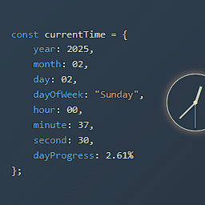

<p align="center">
  
</p>

<h1 align="center">⏰ Enhanced Code Time Wallpaper</h1>

<p align="center">
  A beautifully enhanced interactive wallpaper for <a href="https://www.wallpaperengine.io/">Wallpaper Engine</a> that transforms your desktop into a live developer workspace — complete with a real-time code clock, to-do list, anniversary tracker, goal countdown, and personal photo album.
</p>

<p align="center">
  <a href="#features">Features</a> •
  <a href="#preview">Preview</a> •
  <a href="#installation">Installation</a> •
  <a href="#usage">Usage</a> •
  <a href="#customization">Customization</a> •
  <a href="#tech-stack">Tech Stack</a> •
  <a href="#contributing">Contributing</a> •
  <a href="#license">License</a>
</p>

---

## Features

### 🕐 Real-Time Code Clock
- Live clock rendered as a JavaScript object literal — displays year, month, day, day of week, hours, minutes, seconds, and daily progress percentage
- Analog clock face with animated hour, minute, and second hands
- Smooth 1-second tick updates

### 📝 Todo List (Memo Notepad)
- Handwritten-style notepad that drops down from the top-right corner
- Add, complete, and auto-remove tasks with smooth animations
- Strikethrough + fade-out effect when marking tasks as done
- Persistent storage via `localStorage`

### 🎂 Anniversary Tracker
- Track important dates and see how many days have passed since each one
- Anniversaries are rendered inline in the code clock as `daysSince` variables
- Add and manage anniversaries through the settings drawer

### 🎯 Goal Countdown
- Set future target dates and count down the days remaining
- Goals appear as `daysUntil` variables in the code clock
- Accurate local date parsing (timezone-safe)

### 📷 Photo Album
- Upload personal photos from your local machine
- Photos displayed in a 3-column thumbnail grid
- Click any photo to view it in a full-screen lightbox with zoom animation and elegant border
- Upload area automatically collapses to a compact bar once photos are added
- Photos are compressed and persisted in `localStorage`

### 🌗 Dark / Light Theme
- Toggle between dark and light modes with the moon/sun switch
- Full color adaptation across all UI elements — code syntax colors, clock glow, notepad, settings, and album panel
- Animated gradient backgrounds for both themes

### 🌍 Multi-Language Support (8 Languages)
All UI elements — settings, labels, placeholders, buttons, and empty states — are fully translated:

| Language | Code |
|---|---|
| 简体中文 (Simplified Chinese) | `zh-CN` |
| 繁體中文 (Traditional Chinese) | `zh-TW` |
| English | `en` |
| Español (Spanish) | `es` |
| Português (Portuguese) | `pt` |
| 日本語 (Japanese) | `ja` |
| 한국어 (Korean) | `ko` |
| Français (French) | `fr` |

> **Note:** The code clock section always displays in English to maintain the developer aesthetic.

### ⚙️ Settings Panel
- Toggle each feature on/off independently (Todo, Anniversaries, Goals)
- Manage anniversaries and goals with add/delete controls
- Language selector
- Accessible via the gear icon in the bottom-right corner

---

## Preview

<p align="center">
  
</p>

---

## Installation

### Wallpaper Engine (Recommended)

1. Subscribe to the wallpaper on the [Steam Workshop](https://steamcommunity.com/sharedfiles/filedetails/?id=YOUR_WORKSHOP_ID) *(if published)*
2. Or manually:
   - Download or clone this repository
   - Open Wallpaper Engine → **Open from file**
   - Navigate to the `CodeTime.html` file and select it

### Standalone Browser

You can also run this wallpaper as a standalone web page:

```bash
# Clone the repository
git clone https://github.com/KrataViolet/Enhanced-Code-Time-Wallpaper.git
cd Enhanced-Code-Time-Wallpaper

# Serve locally (requires Node.js)
npx http-server -c-1

# Open in browser
# http://localhost:8080/CodeTime.html
```

---

## Usage

| Control | Location | Action |
|---|---|---|
| 📝 Notepad icon | Top-right | Toggle the todo/memo notepad |
| 🌙/☀️ Toggle | Top-right | Switch between dark and light themes |
| 📷 Album icon | Top-left | Open the photo album panel |
| ⚙️ Gear icon | Bottom-right | Open settings drawer |

### Adding Tasks
1. Click the notepad icon in the top-right corner
2. Type your task in the input field and press `Enter` or click `+`
3. Click the circle checkbox to mark a task as complete — it will strikethrough and fade away

### Managing Anniversaries & Goals
1. Click the gear icon to open the settings drawer
2. Scroll to the **Anniversaries** or **Goals** section
3. Enter a name and date, then click the **Add** button
4. They will appear in the code clock as `daysSince` / `daysUntil` variables

### Uploading Photos
1. Click the album icon in the top-left corner
2. Click the dashed upload area to select images from your computer
3. Click any thumbnail to view it full-screen; hover to reveal the delete button

---

## Customization

All data is stored in `localStorage` under the following keys:

| Key | Description |
|---|---|
| `ct_todos` | Todo list items |
| `ct_anniversaries` | Anniversary entries |
| `ct_goals` | Goal entries |
| `ct_settings` | Feature toggle states |
| `ct_lang` | Selected language code |
| `ct_album` | Photo album (base64) |

To reset all data, clear these keys from your browser's developer console:

```javascript
['ct_todos', 'ct_anniversaries', 'ct_goals', 'ct_settings', 'ct_lang', 'ct_album'].forEach(k => localStorage.removeItem(k));
location.reload();
```

---

## Tech Stack

- **Pure HTML/CSS/JavaScript** — zero dependencies, single-file architecture
- **Google Fonts** — [Caveat](https://fonts.google.com/specimen/Caveat), [LXGW WenKai TC](https://fonts.google.com/specimen/LXGW+WenKai+TC), [Klee One](https://fonts.google.com/specimen/Klee+One), [Nanum Pen Script](https://fonts.google.com/specimen/Nanum+Pen+Script)
- **localStorage** — all user data persisted client-side
- **Canvas API** — image compression for photo uploads
- **CSS Animations** — gradient backgrounds, lightbox zoom, notepad transitions

---

## File Structure

```
Enhanced-Code-Time-Wallpaper/
├── CodeTime.html      # Main wallpaper file (all-in-one)
├── CodeTime.txt       # Plain text copy for Wallpaper Engine compatibility
├── project.json       # Wallpaper Engine project metadata
├── preview.gif        # Preview animation
├── LICENSE            # MIT License
└── README.md          # This file
```

---

## Contributing

Contributions are welcome! Feel free to:

1. **Fork** the repository
2. **Create** a feature branch (`git checkout -b feature/amazing-feature`)
3. **Commit** your changes (`git commit -m 'feat: add amazing feature'`)
4. **Push** to the branch (`git push origin feature/amazing-feature`)
5. **Open** a Pull Request

### Ideas for Contribution
- Additional language translations
- New theme color schemes
- Pomodoro timer integration
- Weather widget
- Spotify / music player integration

---

## Credits

- Original **CodeTime** wallpaper concept from [Wallpaper Engine Steam Workshop](https://steamcommunity.com/id/timaskg/myworkshopfiles/)
- Enhanced with additional features by [KrataViolet](https://github.com/KrataViolet)

---

## License

This project is licensed under the **MIT License** — see the [LICENSE](LICENSE) file for details.

---

<p align="center">
  Made with ❤️ for developers who love a beautiful desktop
</p>
